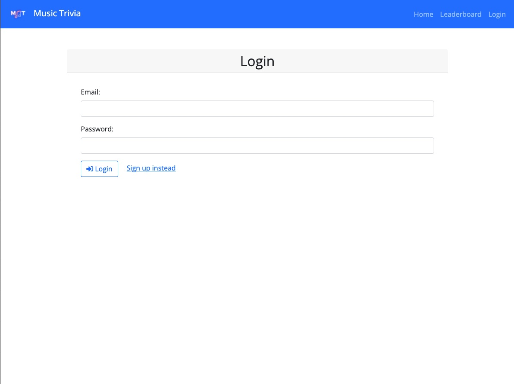
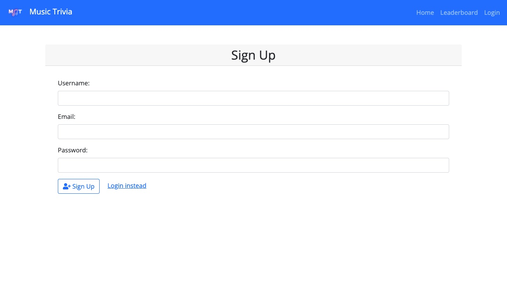
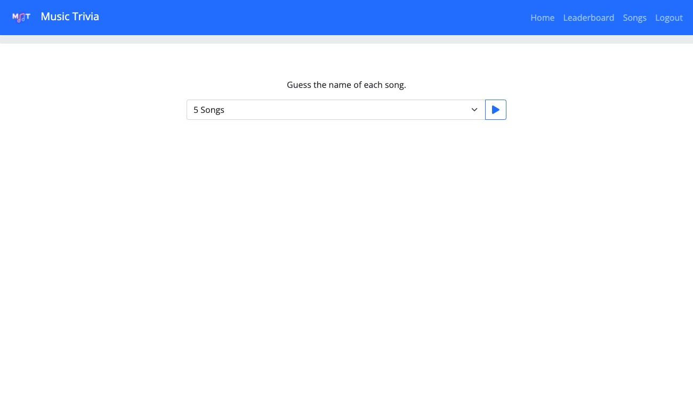
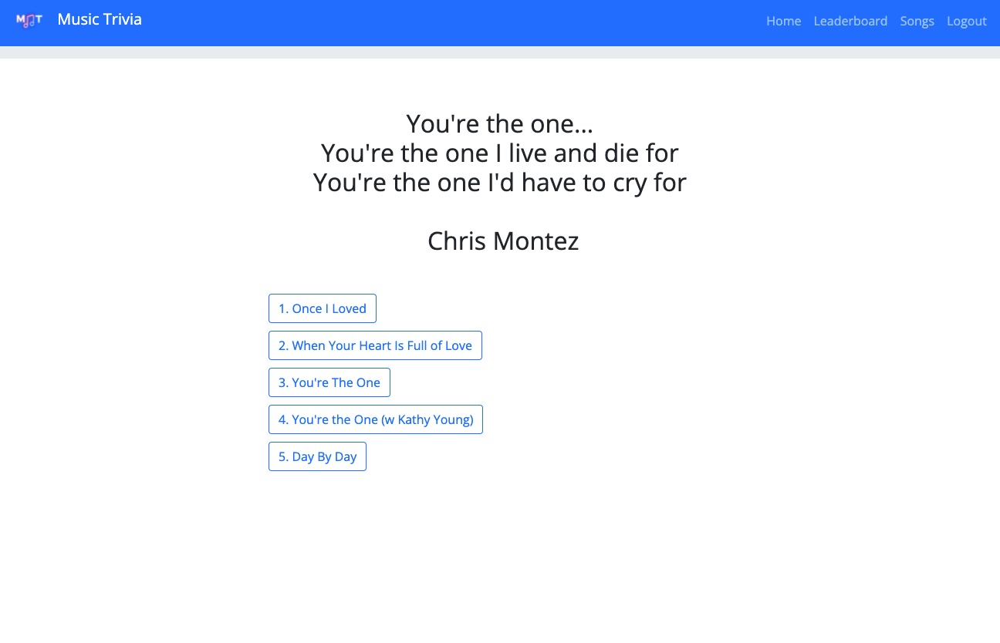
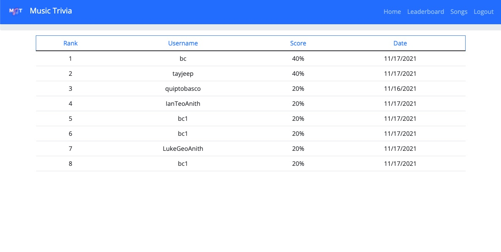

# Project 2: Music Trivia 2.0

## Music Trivia Logo:

[![music-trivia-logo.png][music-trivia-logo]][music-trivia-logo-link]

## Table of Contents

-   [Group Contributors](#group-contributors)
-   [Description](#description)
-   [Links to the Application](#link-to-the-application)
-   [Installation](#installation)
-   [License](#license)
-   [Contributing](#contributing)
-   [Tests](#tests)
-   [Questions](#questions)

## Group Contributors

-   Bryson Cole: Make MySQL database and use Sequelize. Make Get and Post routes.

-   Chona Castillo: GitHub management & organization. README & presentation slide.

-   Daliya Benny: Login and authentication with express-session and cookies.

-   Jimmy Zheng: Work on handlebars, API routes, and styling. Help others.

-   Taylor Paddock: Help with and move JS, CSS, and HTML files into MVC format, help others when needed. Create logo.

-   Tim Renken: Find and implement extra library, package, or technology. Heroku deployment

## Description

-   With the new and improved Music Trivia 2.0, the user can now create an account.
-   The registered owner can login and logout.
-   Once logged in, the registered owner can now look at past highscores of trivias that were taken.
-   The registered owner can lastly search for music videos that are related to the questions that were answered.
-   The registered owner will also hear the Jeopardy Theme Song whilst playing the game.
-   Newer website layout and added company logo.

## Link to the Application

-   [Link to PowerPoint][powerpoint-link]

-   [Link to GitHub][github-repo]

-   [Link to Deployed Application][deployed-link]

## Installation

-   To clone the repository
    -   Make sure you have right access to pull in the repository either by applying 'ssh' keys or by providing a username and password'
    -   Make sure your path is proper
    -   Copy the git command to where you want to clone the repository
    ```
    git clone git@github.com:ChonaC/Project-2-MUSICTRIVIA.git
    ```
    -   You will see a `Project-2-MUSICTRIVIA` folder.
-   An alternate document to clone a repo can also be found at [github][github-link]

## Usage

-   Our application can be viewed here: [Link to Deployed Application][deployed-link]

-   Login


-   Sign Up


-   Quiz Homepage


-   Quiz Question


-   End of Quiz


-   Leaderboard


## License

[](https://opensource.org/licenses/MIT)

https://www.mit.edu/~amini/LICENSE.md

```MIT License

      Copyright (c) 2021 Music Trivia 2.0

      Permission is hereby granted, free of charge, to any person obtaining a copy
      of this software and associated documentation files (the "Software"), to deal
      in the Software without restriction, including without limitation the rights
      to use, copy, modify, merge, publish, distribute, sublicense, and/or sell
      copies of the Software, and to permit persons to whom the Software is
      furnished to do so, subject to the following conditions:

      The above copyright notice and this permission notice shall be included in all
      copies or substantial portions of the Software.

      THE SOFTWARE IS PROVIDED "AS IS", WITHOUT WARRANTY OF ANY KIND, EXPRESS OR
      IMPLIED, INCLUDING BUT NOT LIMITED TO THE WARRANTIES OF MERCHANTABILITY,
      FITNESS FOR A PARTICULAR PURPOSE AND NONINFRINGEMENT. IN NO EVENT SHALL THE
      AUTHORS OR COPYRIGHT HOLDERS BE LIABLE FOR ANY CLAIM, DAMAGES OR OTHER
      LIABILITY, WHETHER IN AN ACTION OF CONTRACT, TORT OR OTHERWISE, ARISING FROM,
      OUT OF OR IN CONNECTION WITH THE SOFTWARE OR THE USE OR OTHER DEALINGS IN THE
      SOFTWARE.
```

## Contributing

[](code_of_conduct.md)

We as members, contributors, and leaders pledge to make participation in our
community a harassment-free experience for everyone, regardless of age, body
size, visible or invisible disability, ethnicity, sex characteristics, gender
identity and expression, level of experience, education, socio-economic status,
nationality, personal appearance, race, caste, color, religion, or sexual identity
and orientation.

We pledge to act and interact in ways that contribute to an open, welcoming,
diverse, inclusive, and healthy community.

Examples of behavior that contributes to a positive environment for our
community include:

-   Demonstrating empathy and kindness toward other people.
-   Being respectful of differing opinions, viewpoints, and experiences.
-   Giving and gracefully accepting constructive feedback.
-   Accepting responsibility and apologizing to those affected by our mistakes, and learning from the experience.
-   Focusing on what is best not just for us as individuals, but for the overall community.

Examples of unacceptable behavior include:

-   The use of sexualized language or imagery, and sexual attention or advances of any kind
-   Trolling, insulting or derogatory comments, and personal or political attacks
-   Public or private harassment
-   Publishing others' private information, such as a physical or email address, without their explicit permission
-   Other conduct which could reasonably be considered inappropriate in a professional setting

This Code of Conduct is adapted from the [Contributor Covenant][homepage],
version 2.1, available at
[https://www.contributor-covenant.org/version/2/1/code_of_conduct.html][v2.1].

Community Impact Guidelines were inspired by
[Mozilla's code of conduct enforcement ladder][mozilla coc].

For answers to common questions about this code of conduct, see the FAQ at
[https://www.contributor-covenant.org/faq][faq]. Translations are available
at [https://www.contributor-covenant.org/translations][translations].

## Tests

Testing can be performed in the command line after installation of the project on the machine. To test the proeject go into the command line and type in

```
npm i
```

to install all the required modules.
To run and test the program refer to the project demo as a walkthrough to get started.
Type in

```
npm start
```

If modules are missing type in

```
npm i
```

and follow the instructions for how to fix package issues.

After all required modules are installed should be able to run the program. It will prompt you for project information. Here is where you can test the project.

## Questions

For questions you can reach us on GitHub at

-   [BCole37][github-bryson]
-   [ByteSizeError][github-jimmy]
-   [daliyaebenny][github-daliya]
-   [ChonaC][github-chona]
-   [quiptobasco][github-tim]
-   [taylorpaddock][github-taylor]

[deployed-link]: https://protected-falls-91774.herokuapp.com/
[faq]: https://www.contributor-covenant.org/faq
[github-link]: https://docs.github.com/en/github/creating-cloning-and-archiving-repositories/cloning-a-repository-from-github/cloning-a-repository
[github-repo]: https://github.com/ChonaC/Project-2-MUSICTRIVIA
[github-bryson]: https://github.com/BCole37
[github-chona]: https://github.com/ChonaC
[github-daliya]: https://github.com/daliyaebenny
[github-jimmy]: https://github.com/ByteSizeError
[github-taylor]: https://github.com/taylorpaddock
[github-tim]: https://github.com/quiptobasco
[homepage]: https://www.contributor-covenant.org
[mozilla coc]: https://github.com/mozilla/diversity
[music-trivia-logo]: https://i.postimg.cc/SQMSzcHD/music-trivia-logo.png
[music-trivia-logo-link]: https://postimg.cc/WtsLBqNk
[powerpoint-link]: https://docs.google.com/presentation/d/1jvwyjJ7dpNLHpVdG6tJ2kyWzcPCzsuZHTdhw_rvaAGw/edit?usp=sharing
[translations]: https://www.contributor-covenant.org/translations
[v2.1]: https://www.contributor-covenant.org/version/2/1/code_of_conduct.html
